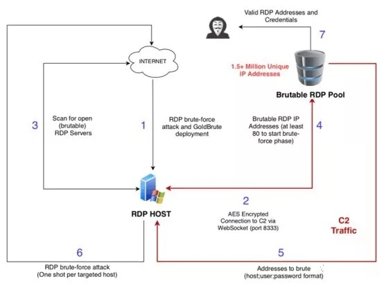

# Source Code of Goldbrute

A new botnet tracked as GoldBrute has appeared in the threat landscape, it is scanning the web for Windows machines with Remote Desktop Protocol (RDP) connection enabled.

The botnet is currently targeting over 1.5 million unique endpoints online, it is used to brute-force RDP connections or to carry out credential stuffing attacks.

“This botnet is currently brute forcing a list of about 1.5 million RDP servers exposed to the Internet. Shdoan lists about 2.4 million exposed servers  [1]. GoldBrute uses its own list and is extending it as it continues to scan and grow.” wrote the researchers Renato Marinho of Morphus Labs who discovered the bot.

The GoldBrute botnet currently has a single command and control server (104[.]156[.]249[.]231), its bots exchange data with the C2 via AES encrypted WebSocket connections to port 8333. 

Querying the Shodan search engine for systems with RDP enabled it is possible to find roughly 2.4 million machines.

“An infected system will first be instructed to download the bot code. The download is very large (80 MBytes) and includes the complete Java Runtime. The bot itself is implemented in a Java class called GoldBrute” continues the expert.

“Initially, the bot will start scanning random IP addresses to find more hosts with exposed RDP servers. These IPs are reported back to the C&C server. After the bot reported 80 new victims, the C&C server will assign a set of targets to brute force to the bot.” 

Botnet brute-forces RDP connection and gains access to a poorly protected Windows system.

It downloads a big zip archive containing the GoldBrute Java code and the Java runtime itself. It uncompresses and runs a jar file called “bitcoin.dll”.

The bot will start to scan the internet for “brutable” RDP servers and send their IPs to the C2 that in turn sends a list of IP addresses to brute force.

GoldBrute bot gets different “host + username + password”  combinations.
Bot performs brute-force attack and reports result back to C2 server.
According to the researcher, the list of “brutable” RDP targets is rapidly growing, this suggests that also the size of the botnet is increasing.

“Analyzing the GoldBrute code and understanding its parameters and thresholds, it was possible to manipulate the code to make it save all “host + username + password” combinations on our lab machine.” continues the expert.

“After 6 hours, we received 2.1 million IP addresses from the C2 server from which 1,596,571 are unique. Of course, we didn’t execute the brute-force phase. With the help of an ELK stack, it was easy to geolocate and plot all the addresses in a global world map, as shown below.”

The GoldBrute botnet is difficult to detect because every bot only launches one password-guessing attempt per victim.

I change the class DownloadProjectsFilesClient.java to use local password and ip file.

RDP服务之GoldBrute僵尸网络源码

安全研究人员已经发现了一个持续复杂的僵尸网络活动，该活动目前在互联网上暴力攻击了超过150万台可公开访问的Windows RDP(远程桌面协议)服务器。GoldBrute僵尸网络由一个C2(命令和控制)服务器控制，与位于美国新泽西州的IP地址(104.156.249.231)相关联。(最新的我捕获到的是一台德国服务器,在Console.java里面)

这个被称为GoldBrute的僵尸网络能够通过不断添加新的破解系统，从而进一步寻找新的可用RDP服务器，然后破解它们。为了躲避安全工具和恶意软件分析师的检测，此恶意活动背后的威胁行为者命令其僵尸网络中每台受感染的设备使用唯一的用户名和密码组合，使得目标服务器接收来自不同IP地址的暴力破解尝试。

由网络安全机构Morphus Labs的首席研究员Renato Marinho发现的该恶意活动，其具体流程如下图所示：

第一步：在成功暴力破解RDP服务器后，攻击者会在此设备上安装一个基于Java的GoldBrute僵尸网络恶意软件。
第二步：为了控制受感染的设备，攻击者利用一个固定集中的C2(命令和控制)服务器，通过AES加密的WebSocket连接交换命令和数据。
第三、四步：随后，每台受感染的设备都会收到第一条任务指令，即扫描并报告至少80台可公开访问的新RDP服务器列表，这些服务器可以被暴力破解。
第五、六步：攻击者为每台受感染设备分配一组特定的用户名和密码，作为其第二条任务指令，它们需要针对上述列表中的RDP服务器进行破解尝试。
第七步：在成功破解后，受感染设备会自动向C2服务器上传登录凭据。

